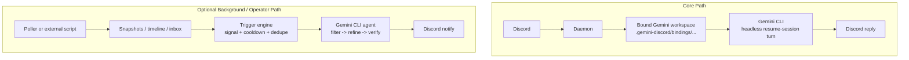

# gemini-discord

`gemini-discord` binds a real local [Gemini CLI](https://geminicli.com) agent to Discord.

The project’s main goal is simple:

> make Discord feel like the Gemini CLI, not like a cheap bot wrapper.

This extension runs a local daemon, routes Discord messages into Gemini CLI headlessly, and keeps Discord channels bound to stable Gemini workspaces so the agent can carry context the same way it does in the terminal.

## What This Project Is

- A Discord bridge for Gemini CLI
- A local daemon + MCP extension pair
- A way to give the same Gemini CLI agent a persistent presence inside Discord
- A system that keeps channel conversations mapped to stable Gemini session workspaces

## What This Project Is Not

- A hosted SaaS bot
- A generic prompt wrapper around a model API
- A giant bundled scraper suite
- A replacement for Gemini CLI itself

The CLI agent is the center of the system. Discord is the transport layer around it.

## Core Idea

Each Discord channel is bound to its own Gemini workspace under:

```text
.gemini-discord/bindings/<binding>
```

When a Discord message arrives, the daemon invokes Gemini CLI headlessly from that bound workspace and resumes the existing session for that workspace. That is why the session history is project-scoped per binding workspace, not per repo root.

```text
Discord message
  -> local daemon
  -> bound Gemini workspace
  -> Gemini CLI headless turn (resume session)
  -> streamed Discord response
```

## True Project Shape



The top path is the product.
The bottom path is optional infrastructure layered around the product.

## Current Behavior

### Gemini CLI Parity

- Discord conversations are bound to stable Gemini workspaces
- Gemini CLI sessions are resumed from those workspaces
- Images are passed as CLI-style `@file` references so Discord image handling matches CLI behavior as closely as possible
- The agent identity comes from your `GEMINI.md`, not from a fake Discord-only persona layer

### Fast-By-Default Runtime

- Ordinary Discord chat turns are treated as plain chat, not full operator runs
- Web research tools are only enabled when the prompt clearly asks for research/current information
- Discord action tools are only enabled when the prompt clearly asks to send, reply, schedule, or inspect Discord state
- Full tool access is reserved for explicit owner/operator requests, not every casual message
- Optional autonomous work is deprioritized so live Discord chat stays responsive

### Session Model

- Default binding scope is per channel
- One Discord channel should map to one Gemini workspace/session lineage
- `/new` resets both the Discord-side transcript mirror and the bound Gemini session state for that channel
- Session listings are workspace-scoped, so checking from the repo root may not show the same sessions as checking from a binding workspace

## Features

- Real Gemini CLI agent inside Discord
- Stable per-channel Gemini session bindings
- Streaming Discord replies
- CLI-style image attachment handling
- Owner/guest tool gating
- Channel discovery and cross-channel sends
- Slash commands for session and daemon control
- Cron reminders
- Scheduled background watch jobs that collect first and wake Gemini at report time
- Optional autonomous away-mode turns
- Status surfaces that expose daemon health, watch jobs, and bound Gemini session state

## Optional Background Intelligence

The project now has an optional background path, but it is intentionally secondary to the Discord binding.

Current built-in background sources:

- Scheduled 4chan `/a/` watch jobs that poll, diff, timeline, then wake Gemini at the requested report time
- Optional always-armed 4chan `/a/` autonomous watcher with timeline, scoring, cooldown, and dedupe

Important constraints:

- Autonomous turns use a separate Gemini binding
- They do not write into normal Discord conversation memory
- They treat collected source text as untrusted
- They are meant to wake Gemini only when there is enough signal

Long term, the intended direction is not to keep stuffing site-specific collectors into the extension. The cleaner direction is:

- external scripts or pollers gather data
- the extension stores normalized snapshots or inbox items
- Gemini CLI is only invoked for filtering, refinement, verification, and final Discord reporting

That keeps the extension lean and keeps the Gemini agent as the intelligence layer instead of turning the repo into a scraper bundle.

## Installation

Requires:

- Node.js 22+
- Gemini CLI installed and authenticated
- A Discord bot token (from [Discord Developer Portal](https://discord.com/developers/applications))

Use a local path while the repo is still private:

```bash
gemini extensions install /absolute/path/to/gemini-discord
```

If you publish the repo later, replace the local path with your Git URL.

During installation, Gemini CLI will prompt for the required configuration variables and store them for the extension. On the first tool call or Discord interaction, the extension will build if needed and wake the daemon automatically.

## Important Configuration

Key settings that you will be prompted for during installation:

| Variable | Default | Purpose |
| --- | --- | --- |
| `DISCORD_BOT_TOKEN` | required | Discord bot token |
| `DISCORD_CHANNEL_ID` | required | Primary/default Discord channel |
| `DISCORD_OWNER_IDS` | required | Users with ownership over the bridge |
| `ALLOWED_CHANNEL_IDS` | required | Channels the bot may operate in |
| `USE_GEMINI_CLI_SESSIONS` | `true` | Use Gemini CLI session resume behavior |
| `GEMINI_SESSION_BINDING_SCOPE` | `channel` | Bind sessions by channel, server, or globally |
| `STREAMING` | `true` | Stream replies into Discord |
| `REQUIRE_MENTION` | `false` | Require explicit mention in guild channels |
| `GEMINI_MODEL` | `gemini-3.1-flash-lite-preview` | Active Gemini model |
| `AUTONOMOUS_TURNS_ENABLED` | `false` | Enable background away-mode turns |
| `AUTONOMOUS_4CHAN_A_ENABLED` | `false` | Enable the built-in `/a/` watcher |

## Slash Commands

Current slash commands include:

- `/new` — start a fresh session for the current channel
- `/status` — show daemon health and runtime info
- `/ping` — latency check
- `/model` — switch models
- `/pool` — inspect CLI pool state
- `/kill` — kill a specific pooled entry

## MCP Tools Exposed To Gemini

| Tool | Purpose |
| --- | --- |
| `discord_status` | Inspect daemon health and bindings |
| `discord_send` | Send a Discord message |
| `discord_reply` | Reply to a specific Discord message |
| `discord_history` | Read recent Discord-side conversation history |
| `discord_reset` | Start a fresh conversation/session |
| `discord_restart` | Restart the daemon |
| `discord_find_images` | Find host images for attachment |
| `discord_channels` | Discover available channels |
| `schedule_cron_job` | Schedule a message |
| `list_cron_jobs` | List cron jobs |
| `delete_cron_job` | Delete a cron job |
| `schedule_watch_job` | Schedule a background watch that collects first and wakes Gemini later |
| `list_watch_jobs` | List active background watch jobs |
| `delete_watch_job` | Delete a background watch job |

## Development

```bash
npm install
npm run typecheck
npm test
npm run build
```

Useful local commands:

```bash
npm run dev:daemon
npm run start:daemon
npm run start:server
npm run install-service
```

## Daemon Lifecycle

The daemon is local and detached, not hosted. After a host reboot it will not be running until something wakes it again. That means:

- the first Discord interaction after a reboot may pay a short wake-up delay
- scheduled background watch jobs only run while the daemon is alive
- if you want true 24/7 uptime on macOS, install the launchd service with `npm run install-service`

## Debugging Notes

If you want to verify that Discord is still using Gemini CLI sessions:

- check `/status` or `discord_status`
- inspect `.gemini-discord/bindings/*/.binding-state.json`
- remember that Gemini session history is scoped to the binding workspace, not necessarily the repo root

If Discord feels slow:

- check whether the prompt is triggering web or Discord action tools
- check daemon status and binding/session info
- verify autonomous mode is not enabled unless you want it
- verify the daemon is running the current build

## Philosophy

The project should stay centered on one job:

> bind Gemini CLI to Discord with high fidelity.

Everything else should support that goal, not bury it.

Background research, cron jobs, pollers, and future agent systems are welcome only if they preserve that core identity:

- the Gemini CLI agent remains the brain
- Discord remains the interface
- extra automation stays modular
- the extension does not become bloated

## License

MIT
